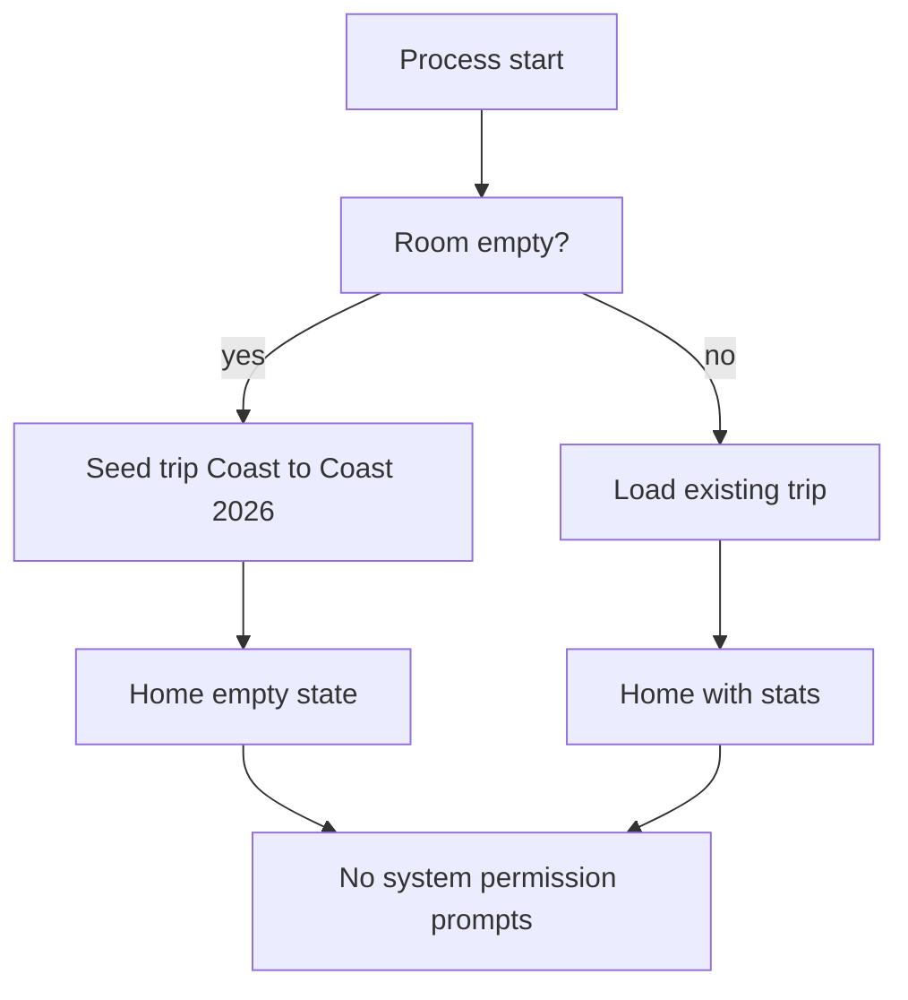
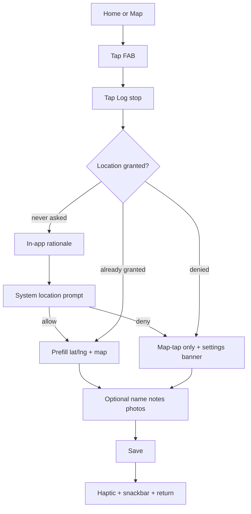
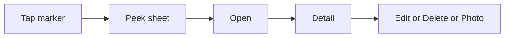
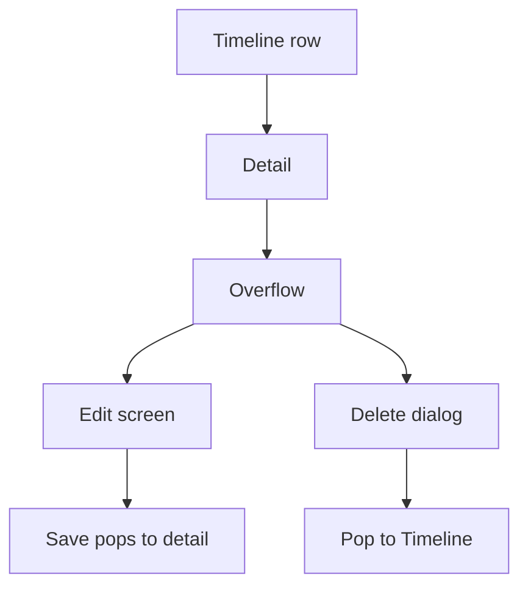
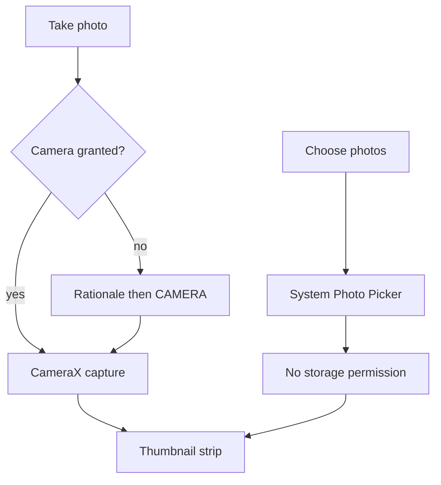

# CoastTrip Android — UX & Product Design

Native Android conversion of the iOS CoastTrip app: an offline USA coast-to-coast road trip journal for locations, photos, and area highlights.

This document is the design source of truth for the first Android build. A clickable Material 3 prototype lives in [`prototype/index.html`](prototype/index.html).

---

## 1. What we are converting

The iOS app is a **single-trip, on-device journal**. It seeds one trip (`Coast to Coast 2026`) and never shows a trip picker. All data stays on device (SwiftData + local JPEGs). There is no account, sync, or social layer.

### iOS information architecture

```
Tab bar
├── Home          trip stats + last 5 activity items + Add Stop / Add Highlight
├── Map           route polyline, stop pins, category-colored highlight markers
└── Timeline      stops + highlights grouped by day, newest first

Modal sheets
├── Add Stop      GPS or map-tap location, optional name/notes/photos
└── Add Highlight name (required), category, 1–5 rating, location, notes, photos

Pushed details
├── Stop          mini-map, name, time, notes, photo grid, edit / delete
└── Highlight     mini-map, category, name, stars, notes, photo grid, edit / delete
```

### Domain objects (parity)

| Object | Fields used in iOS UI | Present in model, unused in UI |
|---|---|---|
| **Trip** | title, startDate, stops, highlights, computed miles/photos | endDate, notes |
| **Stop** | lat/lng, placeName, timestamp, notes, photos | — |
| **Highlight** | name, lat/lng, category, notes, rating (1–5), timestamp, photos | — |
| **TripPhoto** | local file, capturedAt | caption |
| **HighlightCategory** | Scenic, Food, Lodging, Landmark, Other | — |

Miles are the sum of consecutive stop-to-stop distances. Highlights do not contribute to mileage.

### Permissions the iOS app already requests

- Location When In Use — save a check-in coordinate
- Photo Library — attach existing photos
- Camera — shoot in the field

---

## 2. Design stance

**Do not clone iOS chrome.** Keep the same jobs-to-be-done, remap every surface to current Android patterns (Material 3 Expressive, Android 15/16 system behavior).

| iOS pattern | Android replacement | Why |
|---|---|---|
| `TabView` + SF Symbols | `NavigationBar` inside `NavigationSuiteScaffold` | 3 peer destinations; rail/drawer on large screens |
| Two stacked full-width buttons | FAB menu (`Log stop` / `Add highlight`) | Primary creation should not compete with content |
| `.sheet` add forms | Full-screen form destinations + predictive back | Map + photos + fields are too tall for a modal sheet |
| Map marker → sheet | Modal bottom sheet (peek → expand → full detail) | Map stays in context; sheet is the Android idiom |
| In-place Edit/Done toggle | View screen + dedicated edit screen | Clearer back stack, fewer accidental edits |
| `PhotosPicker` + camera sheet | Android Photo Picker + CameraX | No `READ_MEDIA_*` for library; camera permission only when shooting |
| `ContentUnavailableView` | Illustrated empty state + filled button | Material empty-state pattern |
| Confirmation dialog | `AlertDialog` with error-colored confirm | Destructive actions need a speed bump |
| Haptic on save | `performHapticFeedback` + snackbar | Confirm without blocking |

### Principles

1. **One-handed field use.** Check-in is the most frequent action. FAB, current-location, and Save stay in the thumb zone.
2. **Offline by default.** No account wall, no network required after install. Maps degrade to last-known camera + cached tiles when offline.
3. **Permission just-in-time.** Never prompt on first launch. Ask at the moment the user taps *Use current location* or *Take photo*, with an in-app rationale first.
4. **Don’t invent a second product.** v1 matches iOS capability. Android-native extras below are marked **Recommended** and can ship in the same build if you want them; they do not change the data model.
5. **Material You, not a skin.** Dynamic color is on; the iOS accent `#3A72FB` is the fallback seed so brand stays recognizable on devices without wallpaper theming.

---

## 3. Assumptions locked for this design

These match the current iOS product. Questions that would change the design are in [§12](#12-questions-for-you).

- **Single trip.** App still seeds `Coast to Coast 2026` on first launch. No trip list.
- **Feature parity first.** Stops, highlights, map, timeline, photos, notes, ratings, categories, local storage.
- **Imperial distance.** Miles, same formula as iOS.
- **Kotlin + Jetpack Compose + Material 3.** Not Flutter, not a WebView wrapper.
- **Google Maps Compose** for the map surface (Play Services). Offline tile cache is best-effort.
- **minSdk 29 / targetSdk 36.** Photo Picker, predictive back, and edge-to-edge without large compat shims.
- **Portrait primary** on phone (matches iOS). Landscape and inner-display layouts supported on large screens.
- **No accounts, no cloud, no sharing** in v1.

### Recommended Android-only additions (same data model)

These are in the prototype because they are the Android-correct way to handle growing trip data. They can be cut without redesigning the rest.

| Addition | Why it is Android-correct |
|---|---|
| Filter chips on Map and Timeline | Material way to scan a long trip without extra tabs |
| Top app bar search on Timeline | Standard pattern once a journal has dozens of days |
| Settings (trip title, theme, units display) | iOS never exposed `Trip.notes` / `endDate`; Android needs a place for app settings |
| Photo captions on the viewer | Field already exists on `TripPhoto` |
| Dedicated overflow → Edit / Delete | Replaces iOS toolbar Delete sitting next to Edit |

---

## 4. Visual system (Material 3 Expressive)

### Color

Seed / brand primary: **`#3A72FB`** (iOS accent). Dynamic color overlays this on Android 12+ when the user has wallpaper theming enabled.

| Role | Light | Dark |
|---|---|---|
| Primary | `#3A72FB` | `#B4C5FF` |
| On primary | `#FFFFFF` | `#002B75` |
| Primary container | `#DCE4FF` | `#2548C7` |
| Surface | `#F7F8FD` | `#111318` |
| Surface container | `#EBEDF6` | `#1D2026` |
| Surface container high | `#E4E6F0` | `#272A31` |
| On surface | `#1A1C20` | `#E3E2E8` |
| Outline variant | `#C4C6D0` | `#44474F` |
| Error | `#BA1A1A` | `#FFB4AB` |

Highlight categories keep the iOS meaning, mapped to Material tonal spots (not raw iOS system colors):

| Category | Light container | Icon |
|---|---|---|
| Scenic | `#C8E6C9` | `eco` |
| Food | `#FFE0B2` | `restaurant` |
| Lodging | `#BBDEFB` | `hotel` |
| Landmark | `#E1BEE7` | `star` |
| Other | `#E0E0E0` | `place` |

Stops are always primary-blue pins. The route polyline uses primary at 3 dp.

### Type

Material 3 type scale, `Roboto Flex` (or device default):

- Display small — trip title on Home
- Title large — screen titles in collapsing app bars
- Title medium — list row titles, section headers
- Body large / medium — notes
- Label large — buttons, chips, nav destinations
- Label small — timestamps, coordinates

Do not use iOS-style large-title + inline title stacking. Home uses a **medium collapsing TopAppBar**: expanded it shows the trip name as display text; collapsed it pins “Trip”.

### Shape & elevation

- Cards: 16 dp corners, level 1 (`surface-container`)
- FAB: 16 dp default, morphs toward 28 dp when expanded into a menu (Expressive)
- Bottom sheets: 28 dp top corners, drag handle
- Photo tiles: 12 dp
- Navigation bar: flat, `surface-container`, no iOS blur

### Motion

- FAB menu: emphasized spring, 300–400 ms
- Shared-axis X for tab switches (Home ↔ Map ↔ Timeline)
- Shared-axis Y / container transform for Home/Timeline → Detail
- Predictive back on every form and detail
- Map sheet: `ModalBottomSheet` anchors at 40% (peek) and 90% (content)

---

## 5. App structure & navigation

```
CoastTripApp
└── NavigationSuiteScaffold
    ├── HomeRoute
    │     ├── StopDetail / HighlightDetail
    │     └── Settings
    ├── MapRoute
    │     └── Marker sheet → StopDetail / HighlightDetail
    └── TimelineRoute
          └── StopDetail / HighlightDetail

Global (not in the tab back stack)
├── AddStopRoute          full-screen
├── AddHighlightRoute     full-screen
├── EditStopRoute
├── EditHighlightRoute
└── PhotoViewerRoute      horizontal pager
```

### Bottom navigation (phone)

Three destinations, Material symbols, no badges:

| Dest | Icon (selected / unselected) | Label |
|---|---|---|
| Home | `home` / `home` outlined | Home |
| Map | `map` / `map` outlined | Map |
| Timeline | `schedule` / `schedule` outlined | Timeline |

Do **not** add a fourth “Add” tab. Creation is a FAB.

### Floating action button

Shown on **Home** and **Map**. Hidden on Timeline (scanning, not creating) and on every pushed screen.

- Collapsed: circular FAB, `add`
- Expanded (FAB menu):
  1. **Log stop** — filled, `add_location` — primary
  2. **Add highlight** — tonal, `star` — secondary

Opening the menu dims the scrim. Back / tap-outside collapses it (predictive back compatible).

### Large screens (tablet / fold / desktop)

`NavigationSuiteScaffold` switches to a **navigation rail**. Timeline and details use a **list-detail** pane (`ListDetailPaneScaffold`): selecting a row shows the detail beside the list instead of pushing. Map stays full-pane; the marker sheet becomes a side panel (320–400 dp).

---

## 6. Screen specifications

### 6.1 Home — trip dashboard

**Job:** answer “where is this trip at?” and start a check-in in one tap.

**Layout (top → bottom)**

1. Collapsing TopAppBar
   - Expanded: trip title, start date as supporting text
   - Actions: overflow `settings`
2. 2×2 stat grid — Stops, Highlights, Photos, Miles
   - Filled tonal cards, 16 dp, icon in category color, value in title-large, label in label-medium
   - Cards are **not** tappable in v1 (stats are summary only)
3. Section header **Recent activity**
4. Up to 5 activity rows (newest first): leading category icon, title, relative/absolute time, optional 48 dp photo
5. Empty state when both collections are empty (see §8)

**Not on this screen:** the iOS stacked “Add Stop / Add Highlight” buttons. Replaced by the FAB menu.

**Overflow → Settings** is new vs iOS and is the only place to rename the trip.

### 6.2 Map — route canvas

**Job:** see the shape of the trip and jump into a place.

**Chrome**

- Edge-to-edge map. Top app bar is transparent with a short scrim so status-bar icons stay readable.
- Title: “Map”
- Filter chip row overlaid at the top (scrolls horizontally):
  - `All` (default) · `Stops` · `Highlights` · then one chip per category that exists on the trip
- Right-side floating controls (Material small FABs, 40 dp):
  1. My location
  2. Fit route (camera to bounds of all visible markers)
- Main FAB (add menu) bottom-end, 16 dp above the nav bar

**Map content**

- Polyline through **sorted stops only** (parity)
- Stop markers: primary `location_on`
- Highlight markers: filled circle in category color + category icon
- Empty trip: camera on geographic center of the contiguous US (`39.83, -98.58`) at a continental zoom — same as iOS

**Marker tap**

1. Sheet peeks at ~40% with name, category/time, first photo, and two actions: **Open** / **Directions** (Directions is Recommended; opens Google Maps geo intent, does not leave CoastTrip data)
2. Drag or tap **Open** → full `StopDetail` / `HighlightDetail`
3. Scrim tap or predictive back dismisses the sheet; map camera stays put

### 6.3 Timeline — chronological journal

**Job:** replay the trip by day.

**Chrome**

- TopAppBar “Timeline” + search action (Recommended)
- Filter chips: `All` · `Stops` · `Highlights`
- Body: sticky date headers (`EEEE, MMM d`) + rows

**Row**

- 8 dp category rail / icon
- Title (place name or “Stop”; highlight name)
- Supporting: coordinates or category
- Tertiary: time
- Trailing 56 dp photo if present

Empty: illustrated “No entries yet” + “Log a stop” filled button (opens Add Stop).

Search (Recommended): filters title, notes, category, and place name. Results stay grouped by day.

### 6.4 Add Stop — full-screen form

**Job:** drop a pin and leave in under 15 seconds.

**TopAppBar:** Close (X) · title “Log stop” · **Save** (filled, disabled until lat/lng exist)

**Sections**

1. **Location** card
   - Live coordinate + accuracy when a fix exists
   - Filled button **Use current location**
   - Outlined text field **Place name** (optional)
   - 180 dp map; tap to move pin
   - Helper: “Tap the map to adjust the pin.”
   - Denied location: tonal error banner “Location is off. Tap the map, or enable location.” Action → system settings
2. **Notes** — outlined text field, 3–6 lines, hint “What happened here?”
3. **Photos**
   - Outlined button **Choose photos** → Android Photo Picker (max 10)
   - Tonal button **Take photo** → CameraX, `CAMERA` permission just-in-time
   - Horizontal thumbnail strip with remove affordance

Save: write Room rows + JPEG files, medium haptic, pop back, snackbar “Stop saved” with **View**.

Cancel / predictive back with dirty fields: `AlertDialog` “Discard this stop?”

### 6.5 Add Highlight — full-screen form

Same chrome as Add Stop, title “Add highlight”. **Save** disabled until name is non-blank **and** a coordinate exists.

**Highlight** section first:

- Name (required)
- Category — `SingleChoiceFilterChips` or exposed dropdown (chips are easier one-handed)
- Rating — 5 tappable stars, default 3 (parity)

Then Location / Notes / Photos as on Add Stop. Location place-name field is omitted; the highlight **name** is the label.

### 6.6 Stop detail / Highlight detail

**View mode** (default)

- TopAppBar: back · title “Stop” / “Highlight” · overflow (`Edit`, `Delete`)
- 200 dp map hero (or first photo if you prefer; spec uses map for parity)
- Title block: name, timestamp, coordinates; highlight also shows category chip + 5-star row
- Notes block if non-empty
- Photos header + 3-column grid; tap opens Photo Viewer

**Edit** is a **separate route** (not an in-place toggle):

- Same fields as the add form, prefilled
- TopAppBar: Close · “Edit stop” · Save
- Photo grid allows remove; same picker/camera to add
- Save overwrites and pops to the view route

**Delete:** `AlertDialog`

- Title: “Delete this stop?”
- Body: “Photos stored for this stop will be removed from the device.”
- Actions: Cancel · Delete (error container)
- On confirm: delete files + row, pop to the tab that opened the detail, snackbar “Stop deleted”

Highlight delete copy swaps “stop” → “highlight”.

### 6.7 Photo viewer

Full-screen, edge-to-edge, horizontal pager.

- Top scrim: close, optional overflow `Delete photo` when entered from edit
- Bottom scrim: caption (Recommended; empty shows “Add a caption” in edit)
- System bars dark / light icons invert over the photo

### 6.8 Settings (Recommended)

Reached from Home overflow.

- Trip name
- Trip notes (`Trip.notes`, unused on iOS)
- Start date (read-only in v1 unless you want an editor)
- Appearance: Follow system / Light / Dark
- Dynamic color switch (Android 12+)
- Distance: Miles (locked for v1 unless you choose a toggle)
- About: version, privacy one-liner (“All trip data stays on this device.”)

---

## 7. User flows

### First launch



No onboarding carousel. The empty state **is** the onboarding.

### Log a stop from the car



### Add a highlight

Same location branch as a stop. Extra gate: name + category + rating before Save enables.

### Open a place from the map



### Edit / delete from timeline



### Photo attach



---

## 8. Empty, error, and permission states

### Empty

| Surface | Headline | Supporting | Action |
|---|---|---|---|
| Home | No stops yet | Log a stop or highlight as you drive. Everything stays on this device. | Log stop (filled) |
| Timeline | No entries yet | Stops and highlights show up here by day. | Log stop |
| Map | *(no card)* | Continental US camera, no markers | FAB still available |
| Photo grid | Hidden | Section omitted when count is 0 | Add only in edit/create |

### Permissions (critical Android UX)

Never request on splash / Home first frame.

**Location** (`ACCESS_FINE_LOCATION`, optionally `ACCESS_COARSE`)

1. User taps **Use current location** or **My location**
2. If not determined: in-app dialog
   - Title: “Use your location?”
   - Body: “CoastTrip saves a pin for each stop. Location stays on this device.”
   - Actions: Not now · Continue
3. Continue → system prompt
4. Denied: stay on the form; banner with **Open settings**
5. Do not request `ACCESS_BACKGROUND_LOCATION`

**Camera** (`CAMERA`)

1. User taps **Take photo**
2. Same rationale pattern: “Take a photo for this stop?”
3. Denied: hide the camera button, keep Photo Picker

**Photos**

Use the [Android Photo Picker](https://developer.android.com/training/data-storage/shared/photopicker). **Do not** request `READ_MEDIA_IMAGES` or the old `READ_EXTERNAL_STORAGE`.

### Runtime errors

| Error | Treatment |
|---|---|
| Location fix timeout | Snackbar “Couldn’t find GPS. Tap the map instead.” |
| Photo compress / disk write | Inline error on the form, Save stays enabled for a retry |
| Camera unavailable (emulator / missing hw) | Hide Take photo, keep picker |
| Map failed to load (no Play Services) | Static fallback: coordinate text + “Maps unavailable” |

---

## 9. Accessibility, input, and system behavior

- Min 48×48 dp touch targets; FAB 56 dp; stars 48 dp each
- TalkBack: every marker, chip, star, and thumbnail has a name (“Scenic highlight, Grand Canyon, 5 stars”)
- `contentDescription` on decorative map chrome set to null
- Font scale up to 200%: stats wrap to a 1-column grid; app bars do not clip
- Predictive back on forms, details, sheets, photo viewer, FAB menu
- Edge-to-edge: draw behind status and nav bars; pad FAB and lists with `WindowInsets`
- Dark theme: follow system by default
- Haptics: `CONFIRM` on save, `REJECT` on delete confirm
- Locale: dates via `DateTimeFormatter` (device locale); coordinates stay decimal
- No custom back-button UI; use Up in the app bar

---

## 10. Data & platform mapping

| iOS | Android |
|---|---|
| SwiftData `Trip` / `Stop` / `Highlight` / `TripPhoto` | Room entities, same fields and cascade deletes |
| `PhotoStorageService` → Documents/Photos/*.jpg | `filesDir/photos/*.jpg`, JPEG quality 0.85 |
| `LocationManager` When In Use | Fused Location Provider, high accuracy while the add/map screen is resumed |
| MapKit polyline + annotations | Google Maps Compose polyline + `Marker` / `MarkerComposable` |
| PhotosUI picker | `PickMultipleVisualMedia` (max 10) |
| `UIImagePickerController` camera | CameraX `TakePicture`
| `UIImpactFeedbackGenerator` | `HapticFeedbackType` |
| Seed on first launch | Room `@Database` callback / first-run DataStore flag |

Photo files are orphan-cleaned when the parent stop/highlight is deleted (parity).

---

## 11. Recommended stack (for the implementation pass)

Not this PR — captured so the UX does not fight the architecture later.

- Language: Kotlin 2.x
- UI: Jetpack Compose, Material 3 (`androidx.compose.material3`)
- Navigation: Navigation Compose + `NavigationSuiteScaffold`
- DI: Hilt
- Persistence: Room + DataStore (theme / dynamic color)
- Maps: Maps Compose + Play Services Location
- Images: Coil
- Camera: CameraX
- Adaptive: `material3-adaptive-navigation-suite`

Package sketch: `com.coasttrip.app` with `data`, `location`, `photos`, `ui.home`, `ui.map`, `ui.timeline`, `ui.stop`, `ui.highlight`, `ui.settings`.

---

## 12. Questions for you

Answer these and the design can be locked for implementation. Defaults used in the prototype are in parentheses.

1. **Single trip or many?** Stay with one seeded coast-to-coast trip (default), or should Android launch with a trip list / “start a new trip”?
2. **Maps provider?** Google Maps + Play Services (default), or MapLibre/OSM so the app can ship without a Google API key and work better on devices without Play?
3. **v1 extras?** Keep the Recommended items (search, filter chips, settings, captions), or strip to strict iOS parity?
4. **Units?** Miles only (default), or a Settings toggle for kilometers?
5. **Directions outlink?** Marker sheet “Directions” opens Google Maps — keep, or stay 100% inside CoastTrip?
6. **After you review this:** start the Kotlin/Compose project in this repo, or revise the prototype first?

---

## 13. Prototype

Open [`prototype/index.html`](prototype/index.html) in a browser. It is a phone-framed, clickable pass through:

- Home with stats and recent activity
- FAB menu → Log stop / Add highlight
- Add Stop (location, notes, photos, validation)
- Add Highlight (category chips, stars)
- Map with filters, markers, and peek sheet
- Timeline by day
- Stop and Highlight details, overflow edit/delete
- Delete confirmation
- Location rationale
- Settings
- Light / dark theme toggle

Sample journal data is a fictional Sep 2026 coast-to-coast drive so every surface has content. Use **Empty trip** in the prototype toolbar to see first-launch states.
